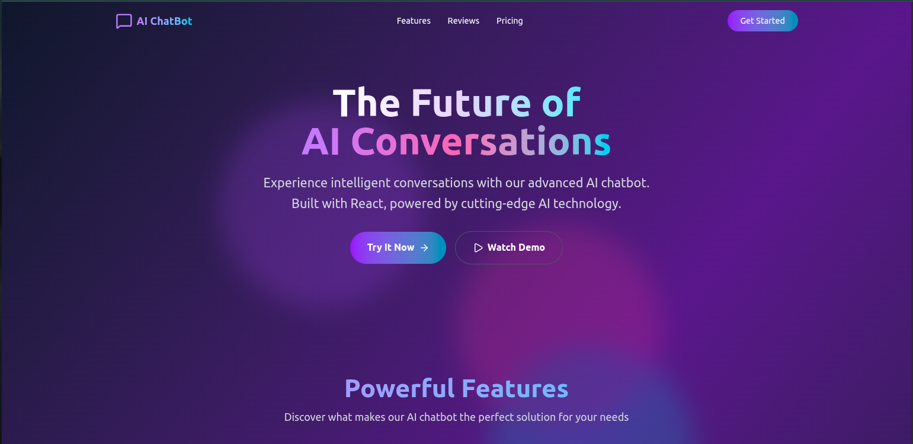
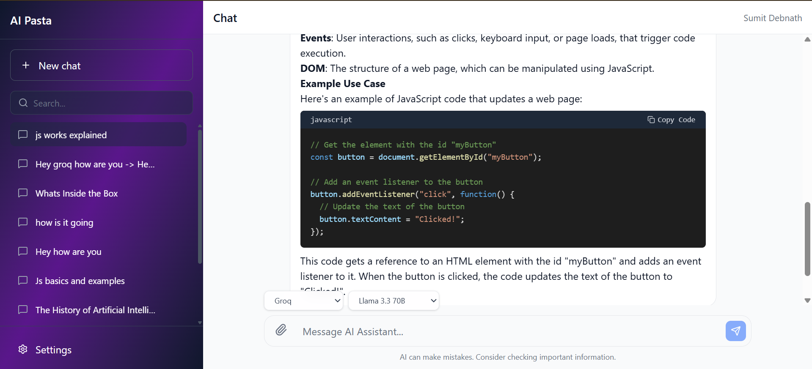
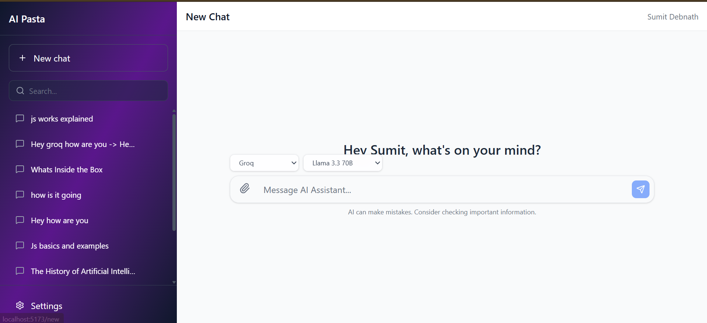
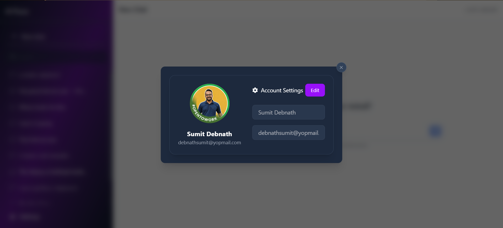
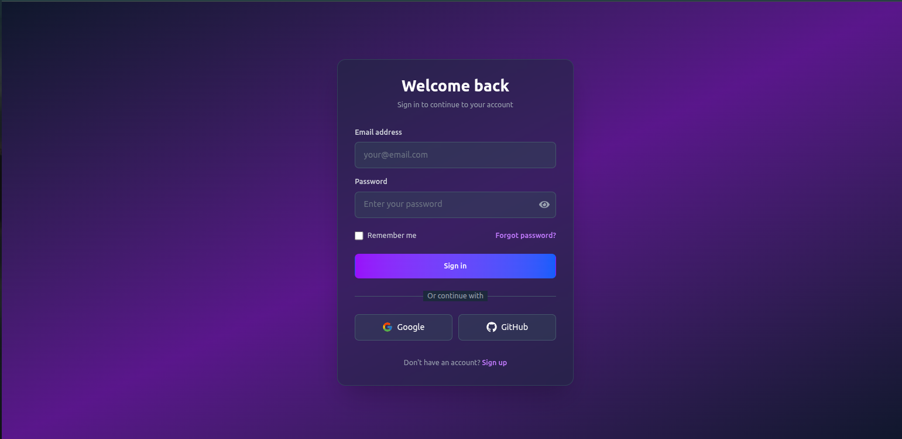
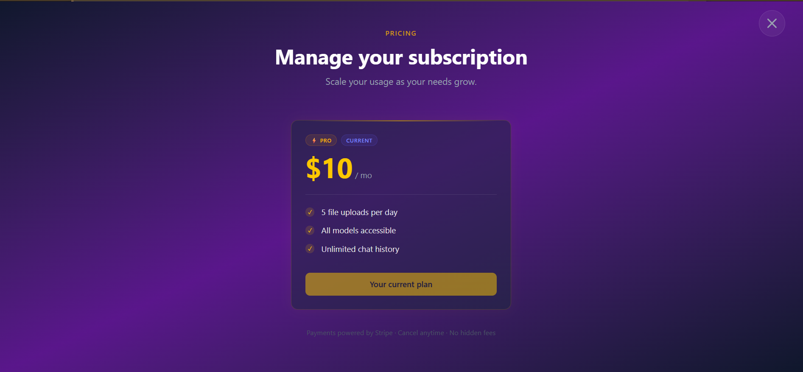
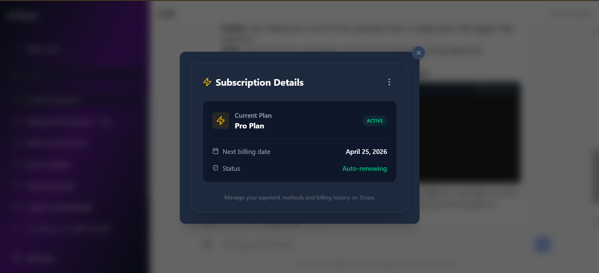

# 🤖 AI Chat — Frontend

A modern, full-featured AI chat interface built with **React + Vite**, supporting multiple AI providers, real-time streaming responses, and persistent chat history. Pairs with the [AI-chat-backend](https://github.com/debnath96sumit/AI-chat-backend) service.

---

## ✨ Features

- **Multi-Provider AI Support** — Seamlessly switch between Groq, Google Gemini, and Hugging Face Inference models
- **Real-time Streaming** — Token-by-token streaming responses for a natural, ChatGPT-like feel
- **User Authentication** — Secure login and registration flow
- **Chat History** — Persistent conversation history with support for multiple independent chat sessions
- **Markdown Rendering** — AI responses rendered with full Markdown support (code blocks, lists, headings, etc.)
- **File Upload & Analysis** — Upload PDFs and text files and chat with them directly. Extract insights, summarize content, and ask questions about your documents.
- **Subscription Plans** — Added subscriptions for users to upgrade their plans.

---

## 🖼️ Screenshots
 








---

## 🏗️ Tech Stack

| Layer | Technology |
|---|---|
| Framework | React 18 |
| Build Tool | Vite |
| Styling | Tailwind CSS |
| Language | JavaScript (ES2022) |
| AI Providers | Groq, Google Gemini, Hugging Face Inference |
| Backend | [AI-chat-backend](https://github.com/debnath96sumit/AI-chat-backend) (NestJS) |

---

## 🚀 Getting Started

### Prerequisites

- Node.js >= 18
- npm or yarn
- The [AI-chat-backend](https://github.com/debnath96sumit/AI-chat-backend) running locally or deployed

### Installation

```bash
# Clone the repository
git clone https://github.com/debnath96sumit/AI-Chat-Frontend.git
cd AI-Chat-Frontend

# Install dependencies
npm install
```

### Environment Variables

Copy the example env file and fill in your values:

```bash
cp .env.example .env
```

```env
VITE_API_BASE_URL=http://localhost:3000   # URL of your AI-chat-backend
```

### Running Locally

```bash
# Development mode with hot reload
npm run dev

# Build for production
npm run build

# Preview production build
npm run preview
```

---

## 🔌 Backend

This frontend is designed to work with the **AI-chat-backend** — a NestJS service that handles:

- Authentication (JWT)
- AI provider routing (Groq / Gemini / Hugging Face)
- Chat session & message persistence
- Streaming response forwarding

👉 [View the backend repository](https://github.com/debnath96sumit/AI-chat-backend)

---

## 🤝 Contributing

Contributions, issues, and feature requests are welcome. Feel free to check the [issues page](https://github.com/debnath96sumit/AI-Chat-Frontend/issues).

---

## 👨‍💻 Author

**Sumit Debnath**

- LinkedIn: [linkedin.com/in/sumit-debnath-2214a6144](https://linkedin.com/in/sumit-debnath-2214a6144)
- GitHub: [@debnath96sumit](https://github.com/debnath96sumit)

---

## 📄 License

This project is open source and available under the [MIT License](LICENSE).